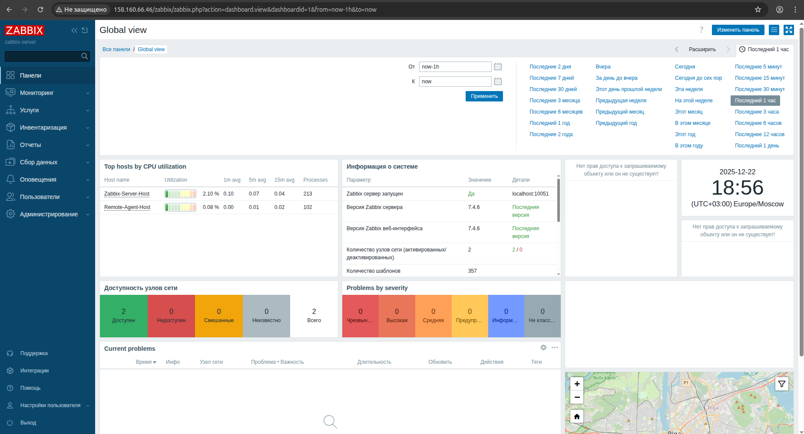
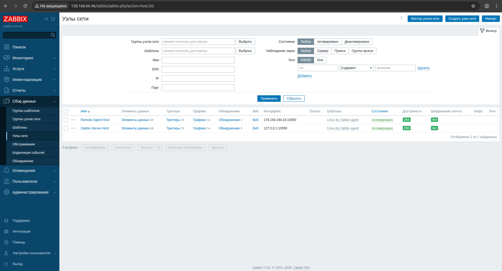
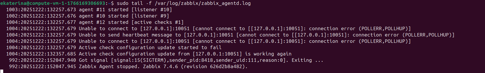
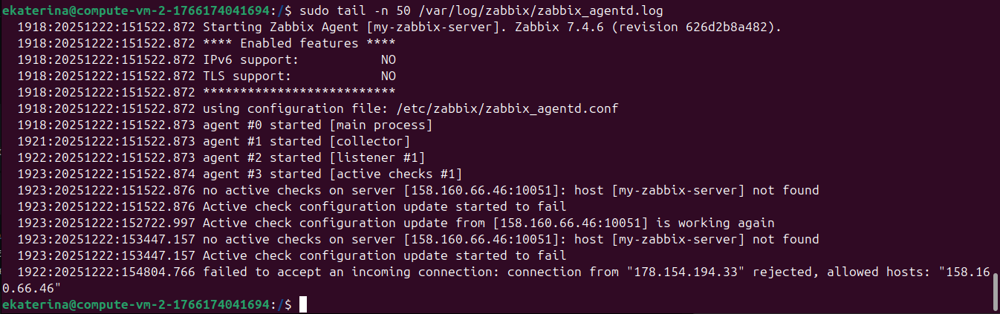
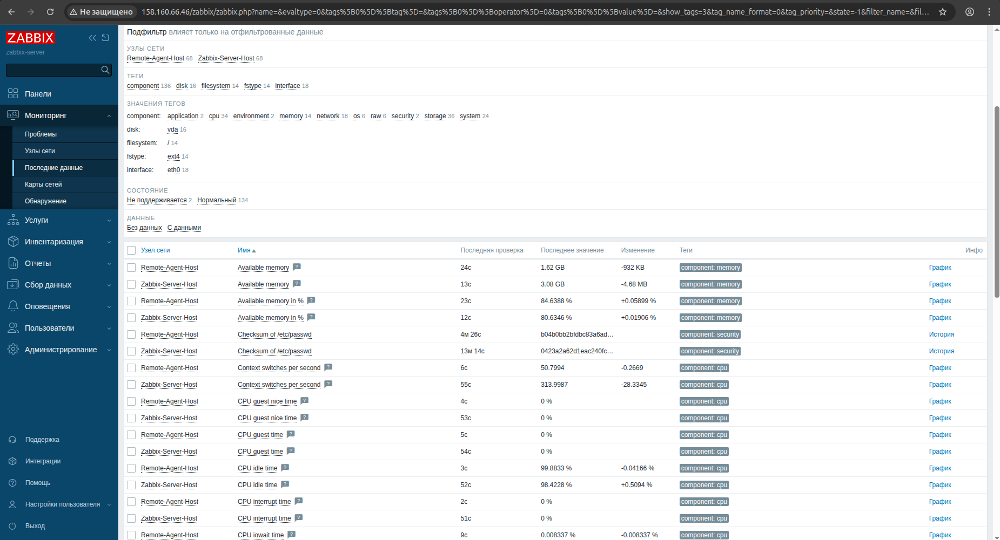

# Домашнее задание к занятию "`Система мониторинга Zabbix`" - `Минаевой Екатерины`

### Решение 1



```
sudo apt update
sudo apt install postgresql postgresql-contrib -y
wget https://repo.zabbix.com/zabbix/7.4/release/ubuntu/pool/main/z/zabbix-release/zabbix-release_latest_7.4+ubuntu24.04_all.deb
sudo dpkg -i zabbix-release_latest_7.4+ubuntu24.04_all.deb
sudo apt update
sudo apt install zabbix-server-pgsql zabbix-frontend-php php8.3-pgsql zabbix-apache-conf zabbix-sql-scripts zabbix-agent -y
sudo zcat /usr/share/zabbix/sql-scripts/postgresql/server.sql.gz | sudo -u zabbix psql zabbix
sudo nano /etc/zabbix/zabbix_server.conf  #изменить DBPassword= 
sudo nano /etc/locale.gen #раскомментировать ru_RU.UTF-8
sudo locale-gen
sudo systemctl restart zabbix-server zabbix-agent apache2
sudo systemctl enable zabbix-server zabbix-agent apache2
```

---

### Решение 2









Агент 1 был установлен при выполнении задания 1. Для настройки:

`sudo nano /etc/systemd/system/zabbix-agent.service`

Настройки:

```
[Unit]
Description=Zabbix Agent
After=network.target

[Service]
Type=simple
User=zabbix
Group=zabbix
ExecStart=/usr/local/sbin/zabbix_agentd -c /etc/zabbix/zabbix_agentd.conf -f
Restart=always

[Install]
WantedBy=multi-user.target
```

```
sudo nano /etc/zabbix/zabbix_agentd.conf
sudo systemctl daemon-reload
sudo systemctl enable zabbix-agent --now
```

Установка и настройка Агента 2:

```
sudo groupadd --system zabbix
sudo useradd --system -g zabbix -d /usr/local/share/zabbix -s /sbin/nologin zabbix
sudo mkdir -p /etc/zabbix /var/log/zabbix /var/run/zabbix
sudo chown -R zabbix:zabbix /var/log/zabbix /var/run/zabbix
wget https://cdn.zabbix.com/zabbix/binaries/stable/7.4/7.4.6/zabbix_agent-7.4.6-linux-3.0-amd64-static.tar.gz
sudo tar -xzvf zabbix_agent-7.4.6-linux-3.0-amd64-static.tar.gz -C /usr/local/
sudo cp /usr/local/conf/zabbix_agentd.conf /etc/zabbix/zabbix_agentd.conf
```

`sudo nano /etc/systemd/system/zabbix-agent.service`

Настройки:

```
[Unit]
Description=Zabbix Agent
After=network.target

[Service]
Type=simple
User=zabbix
Group=zabbix
ExecStart=/usr/local/sbin/zabbix_agentd -c /etc/zabbix/zabbix_agentd.conf -f
Restart=always

[Install]
WantedBy=multi-user.target
```

```
sudo nano /etc/zabbix/zabbix_agentd.conf
sudo systemctl daemon-reload
sudo systemctl enable zabbix-agent --now
```

Для проверки связи с удаленным агентом:

`zabbix_get -s 178.154.194.43 -p 10050 -k agent.ping`

---
